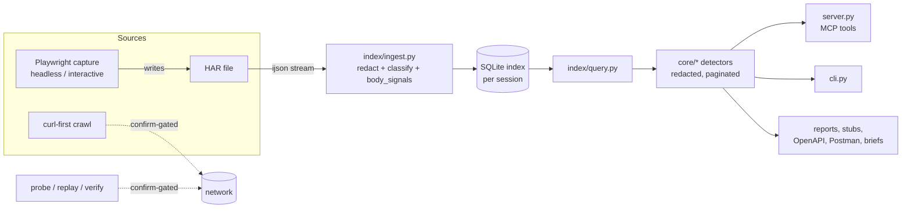

# Architecture

> Purpose: How data flows through hardly, from a HAR or live capture to redacted query tools and generated artefacts, and the design rules that keep it safe.

## Data flow



1. **Ingest** (`index/ingest.py`): ijson streams entries so large HARs never load whole. Each entry is
   filtered for noise, its URL templated (`/users/42` to `/users/{id}`), secret query values redacted,
   text bodies decoded, and per-body signals (`body_signals`: content kind, value shapes, framework
   hints, double-encoded JSON, ...) computed once.
2. **Index**: one SQLite database per HAR, held in memory unless you pass an output path (below).
   `session.py` maps `session_id` to the connection; sessions are in-memory unless the
   caller names a file.
3. **Query**: `index/query.py` and `core/*` modules read the index and return small dictionaries.
   Detectors return evidence (names, shapes, counts, entry ids); prose advice appears only with
   `explain=true`. Output is paginated and bodies are truncated.
4. **Outputs**: `hardly_session_report` (one-pass findings), `hardly_client_build`, `hardly_write_export`
   (OpenAPI, Postman, Markdown, briefs, reports, browser steps) are built from the same index.

## Capture paths

- **In-process headless** (`capture.py`, `capture_headless`): one-shot discovery and recipes.
- **Durable worker** (`capture_worker.py`): a subprocess that keeps a browser alive across calls
  (start / aria / click / stop), with disk sidecars so stop works across processes. Opt in for
  one-shots with `HARDLY_CAPTURE_SUBPROCESS=1`.
- **Interactive**: headed browser, a person drives; the agent only starts and stops.
- Capture slots bound concurrency (`HARDLY_CAPTURE_SLOTS`, `HARDLY_CAPTURE_SLOT_TIMEOUT`), budgets
  bound recipe time, and failures are classified (`error_class`). After stop, the HAR is opened as a
  normal archive session.

## Live-tool gating

Anything that sends traffic (every `hardly_send_*` tool, and `hardly_browser_capture_discover`)
requires `confirm=true` (CLI `--confirm`). Without it the tool returns a plan and sends nothing. Live tools stop at gates (bot walls, challenges, rate limits,
environment blocks) per [gate-policy.md](gate-policy.md) and never evade them; crawl honours
robots.txt and per-host delays. Secrets for probes come only from explicit overrides.

## Redaction model

- Redaction happens at **ingest** (secret query values) and again at **output** (`core/redact.py`),
  so nothing downstream can echo a raw credential.
- Credential tools report **names and shapes** (jwt, hex, base64, lengths), cookie flags and
  roles, never values.
- Generated stubs use placeholders and carry server-issued tokens forward at runtime from earlier
  responses rather than embedding literals.
- The raw HAR is never returned by any tool.

## Saving: one rule

**Give an output path to save; otherwise nothing is written.** There are no storage modes, no
environment variables and no cache directory.

- `hardly_session_open(har_path)`: the HAR is ingested into `:memory:` and sealed (`PRAGMA query_only`). Nothing reaches
  disk, so no derived data (redacted previews, headers, shapes) is left behind.
- `open_session(har, output_path=P, overwrite=False)` (Python) or `hardly_write_session_copy(session_id, output_path, format='index')`
  (MCP; CLI `hardly session open HAR -o P`): additionally writes the index to `P`: `VACUUM INTO` a temp
  file in `P`'s directory, then `os.replace`. Never in place; an existing `P` is refused unless
  `overwrite`. The proof of what the index was built from lives inside it (`meta` table: `har_path`,
  `har_size`, `har_mtime`, `index_version`); there are no sidecar files.
- `hardly_session_open(P)`: `P` may be a HAR or a saved index (detected by the SQLite header and the embedded
  meta). A saved index opens read-only (`mode=ro`) without re-ingesting. If its `index_version` is not
  this build's, `index_outdated` tells you to re-open the original HAR and rewrite the index.

```python
from hardly import open_session

with open_session("capture.har") as s:                       # memory only
    s.conn  # read-only sqlite3 connection; s.session_id, s.info
with open_session("capture.har", output_path="idx.db"):      # also saved
    ...
with open_session("idx.db") as s:                            # no re-ingest
    ...
```

**Idempotence.**
1. The session id is a pure function of the resolved input path (HAR or index file).
2. Opening it again returns the same live session without re-ingesting. Handles are reference counted:
   a nested `with` does not close the outer one, the session closes when the last handle closes,
   `close()` is idempotent per handle and saves nothing. The MCP/CLI layer holds one reference until
   `hardly_session_close`.
3. Opening a live session again *with* `output_path` just saves it there.
4. Ingest output is a pure function of the HAR bytes and `INDEX_VERSION` (tested: two ingests have equal
   table dumps), and reopening after close gives an identical summary.

**Why no cache or path registry.** An implicit cache directory leaves files nobody asked for and nobody cleans up, and a registry of opened paths is
hidden state too. So an unknown session id (after a restart, or any unsaved session) returns the
deterministic `unknown_session` error telling the caller to call `hardly_session_open` again with the same
path.

**Source HAR.** `hardly_write_session_copy(session_id, output_path, format='har', overwrite=False)` (CLI
`hardly write session-copy HAR -o OUT`) copies the source HAR atomically (never in place).

**Ephemeral captures.** A capture without an output path records to a private temp file
(`<tempdir>/hardly-<uid>/ephemeral/`, dir 0700, file 0600), is ingested into a memory session and the
file is deleted straight away (also on error, at exit, and by a sweep of files older than an hour at
startup). The result says `har_path: null, ephemeral: true`; pass `har_output_path` (CLI `-o`) to keep the HAR, or
save the resulting session with `hardly_write_session_copy(session_id, output_path, format='index')`. With an output path the
file is kept.

**Read-only.** Query code never writes; temp tables stay allowed and use `temp_store=MEMORY`. A memory
database is private to its single connection, which hardly keeps (`check_same_thread=False`); never
open a second connection to one.

## INDEX_VERSION rule

`INDEX_VERSION` (in `index/ingest.py`) is stored inside each index (`meta` table). On open, an index
file with a different version is refused with `index_outdated` and is rebuilt only by re-opening the HAR and rewriting it with `overwrite=true`. Bump it whenever ingest changes what it stores or
what a stored value means (new `body_signals`, changed redaction, changed templating). Pure query-side
changes do not need a bump.

## Extension points

A new detector is a `core/` module plus a test, wired into `server.py`, `cli.py`, `capabilities.py`
and `scripts/gen_tool_docs.py`, and a new tool or command also updates the API snapshots (see
[AGENTS.md](../AGENTS.md) and [api-stability.md](api-stability.md)). Downstream vocabularies and target
collections plug in through arguments and the neutral `TargetAdapter` / catalog ([catalog.md](catalog.md)),
never through site-specific code in hardly. See [scope.md](scope.md).
