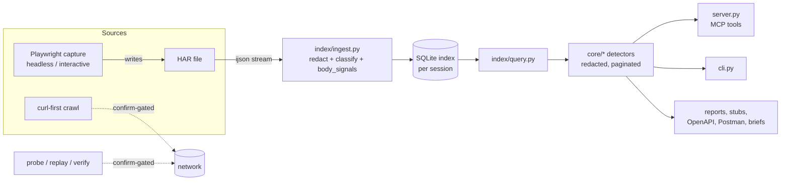

# Architecture

> Purpose: How data flows through hardly, from a HAR or live capture to redacted query tools and generated artefacts, and the design rules that keep it safe.

## Data flow

1. **Ingest** (`index/ingest.py`): ijson streams entries so large HARs never load whole. Each entry is
   filtered for noise, its URL templated (`/users/42` to `/users/{id}`), secret query values redacted,
   text bodies decoded, and per-body signals (`body_signals`: content kind, value shapes, framework
   hints, double-encoded JSON, ...) computed once.
2. **Index**: one SQLite database per HAR in the cache dir (`HARDLY_CACHE_DIR`, default
   `~/.cache/hardly`), plus a small metadata JSON. `session.py` maps `session_id` to the connection
   and reattaches from the cache after an MCP restart.
3. **Query**: `index/query.py` and `core/*` modules read the index and return small dictionaries.
   Detectors return evidence (names, shapes, counts, entry ids); prose advice appears only with
   `explain=true`. Output is paginated and bodies are truncated.
4. **Outputs**: `hardly_report` (one-pass evidence index), client stubs, OpenAPI, Postman, Markdown
   briefs and recipe plans are built from the same index.

## Capture paths

- **In-process headless** (`capture.py`, `capture_headless`): one-shot discovery and recipes.
- **Durable worker** (`capture_worker.py`): a subprocess that keeps a browser alive across calls
  (start / aria / click / stop), with disk sidecars so stop works across processes. Opt in for
  one-shots with `HARDLY_CAPTURE_SUBPROCESS=1`.
- **Interactive**: headed browser, a person drives; the agent only starts and stops.
- Capture slots bound concurrency (`HARDLY_CAPTURE_SLOTS`, `HARDLY_CAPTURE_SLOT_TIMEOUT`), budgets
  bound recipe time, and failures are classified (`error_class`). After stop, the HAR is opened as a
  normal archive session.

## Live-tool gating

Anything that sends traffic (`probe`, `crawl`, `redirect_diag`, `arcgis_explore`, `replay_check`,
`replay_flow`, `catalog_verify`) requires `confirm=true` (CLI `--yes`). Without it the tool returns a
plan or an error and sends nothing. Live tools stop at gates (bot walls, challenges, rate limits,
environment blocks) per [gate-policy.md](gate-policy.md) and never evade them; crawl honours
robots.txt and per-host delays. Secrets for probes come only from explicit overrides.

## Redaction model

- Redaction happens at **ingest** (secret query values) and again at **output** (`core/redact.py`),
  so nothing downstream can echo a raw credential.
- Credential tools report **names and shapes** (jwt, hex, base64, lengths), cookie flags and
  roles, never values.
- Generated stubs use placeholders and carry server-issued tokens forward at runtime from earlier
  responses rather than embedding literals.
- The raw HAR is never returned by any tool.

## INDEX_VERSION rule

`INDEX_VERSION` (in `index/ingest.py`) is stored in each session's metadata. On open, a cached index
with a different version is rebuilt from the HAR. Bump it whenever ingest changes what it stores or
what a stored value means (new `body_signals`, changed redaction, changed templating). Pure query-side
changes do not need a bump.

## Extension points

A new detector is a `core/` module plus a test, wired into `server.py`, `cli.py`, `capabilities.py`
and `scripts/gen_tool_docs.py` (see [AGENTS.md](../AGENTS.md)). Downstream vocabularies and target
collections plug in through arguments and the neutral `TargetAdapter` / catalog ([catalog.md](catalog.md)),
never through site-specific code in hardly. See [scope.md](scope.md).
